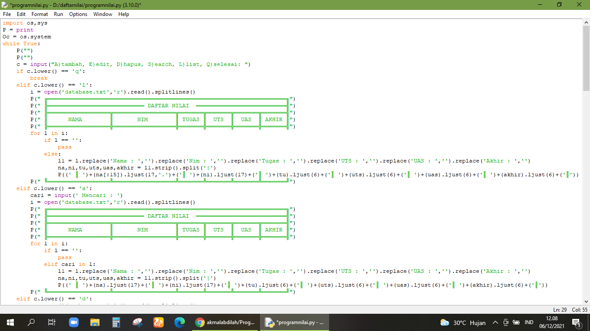
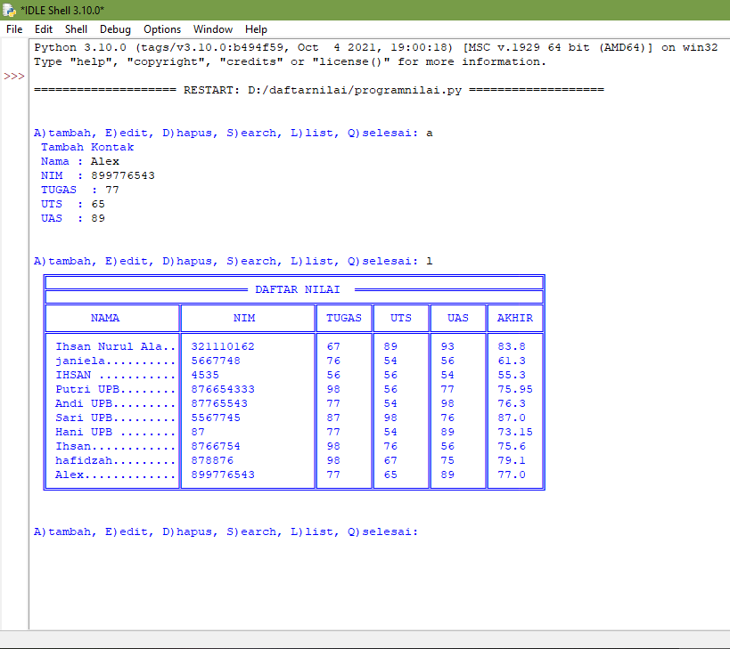

# pertemuan10
## Menambahkan pilihan Edit,cari,list,hapus Dari pertemuan 9
Untuk programnya bisa di lihat di directory dengan nama file programnilai.py
### Pembahasan
1. Silahkan samakan codingan phyton seperti contoh yang saya berikan di file "programnilai.py jika kodingan/perintah sudah sesuai seperti pada gambar berikut 

2. Maka outputnya akan seperti pada gambar beriut 

note : opsi A untuk menambahkan data(add), E untuk edit data(edit), S untuk mencari(search), L untuk menampilkan list, Q untuk selesai program (quit)
Terimakasih.....